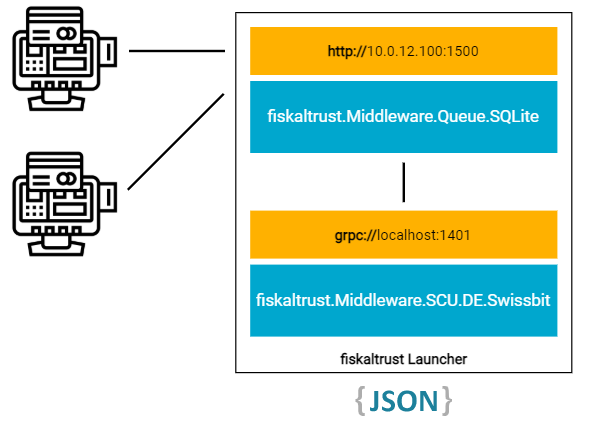

# fiskaltrust Launcher
The **fiskaltrust Launcher** is an application that hosts the packages of the **fiskaltrust Middleware**, a modular fiscalization and POS platform that can be embedded into POS systems to suffice international fiscalization regulations.

> **Warning** 
>This all-new fiskaltrust Launcher is currently in development. We plan to release a preview version to interested customers soon - please reach out to us in the [discussion section](https://github.com/fiskaltrust/middleware-launcher/discussions) if you want to participate.

**You can track the ongoing development of the first release in the project's [backlog and board](https://github.com/orgs/fiskaltrust/projects/3/).**

## Overview

Middleware packages each provide specific fiscalization-, data source- and security device implementations. These package can be aggregated into a configuration container (_Cashbox_) in the fiskaltrust Portal. The Launcher then uses this configuration to decide which packages to download and run, and provides configurable hosted endpoints so that the POS software can communicate with them (e.g. gRPC or HTTP).

Below, we illustrate a minimal sample configuration with the international SQLite _Queue_ package (with a configured HTTP endpoint) and a German _Signature Creation Unit_ (with a gRPC endpoint) that abstracts a Swissbit TSS. 

<div align="center">
  
</div>


## Getting Started

> warning: This beta version  of the Launcher 2.0 is for test purpose only and should be used with our German sandbox.

Download the latest release from GitHub. We always recommend using the latest release to benefit from the newest improvements.
Unzip the downloaded release.

Start the Launcher via the commandline:
```sh
fiskaltrust.Launcher.exe run --cashbox-id <cashboxid> --access-token <accesstoken> --sandbox
```

To stop the Launcher press <kbd>Ctrl</kbd> + <kbd>C</kbd>.

> ***Note:***  
> See help for other start parameters:
> ```sh
> fiskaltrust.Launcher.exe run --help
> ```
> See help for other available commands:
> ```sh
> fiskaltrust.Launcher.exe --help
> ```

## Migration guide

> Caution: To switch from a launcher version 1.3.x to a version 2.0 is possible using the version Launcher 2.0- Public Preview 3 onwards.

Before switching from a 1.3.x Launcher to a Launcher 2.0, please make sure that the packages configured are compatible. You can check with the [table of the supported Packages in the Alpha](#supported-packages-in-the-alpha).

Run the uninstall-service.cmd or sh command to deinstall the old launcher.

Create the [configuration file](#launcher-configuration), and make sure to include the cashboxId and access token. 

In the new launcher folder run the following command `.\fiskaltrust.Launcher.exe install --sandbox`.

To check that the switch is successful, try send receipt to the middleware using our Postman collection.
## Supported Packages in the Alpha

In the sandbox configure a cashbox based on the list of supported packages below.

| Name                                           | Versions               |
| ---------------------------------------------- | ---------------------- |
| fiskaltrust.Middleware.Queue.MySQL             | v1.3.37                |
| fiskaltrust.Middleware.Queue.SQLite            | v1.3.38-ci-22221-55477 |
| fiskaltrust.Middleware.SCU.DE.FiskalyCertified | v1.3.35                |
| fiskaltrust.Middleware.SCU.DE.CryptoVision     | v1.3.34                |
| fiskaltrust.Middleware.SCU.DE.DeutscheFiskal   | v1.3.35                |
| fiskaltrust.Middleware.SCU.DE.DieboldNixdorf   | v1.3.20                |
| fiskaltrust.Middleware.SCU.DE.Epson            | v1.3.19                |
| fiskaltrust.Middleware.SCU.DE.Swissbit         | v1.3.35-rc1            |
| fiskaltrust.Middleware.SCU.DE.SwissbitCloud    | v1.3.35                |
| fiskaltrust.Middleware.Helper.Helipad          | v1.3.26                |

### Launcher configuration

The Launcher 2.0 configuration is now read from a json file (`launcher.configuration.json` in the working directory per default).The configuration has to be created mannually.

This file can be set via the `--launcher-configuration-file` cli argument.

The configuration file should contain the following config keys:
```jsonc
{
  
  "ftCashBoxId": "<ftCashBoxId>",         // string
  "accessToken": "<accessToken>",         // string
  "launcherPort": "<launcherPort>",       // int (default: 5050)
  "serviceFolder": "<serviceFolder>",     // string (default-windows: "C:/ProgramData/fiskaltrust", default-linux: "/var/lib/fiskaltrust", default-macos: "/Library/Application Support/fiskaltrust")
  "sandbox": "<sandbox>",                 // bool (default: true)
  "useOffline": "<useOffline>",           // bool (default: false)
  "launcherVersion": "<launcherVersion>", // string (default: null)
  "logFolder": "<logFolder>",             // string (default: "<serviceFolder>/logs")
  "logLevel": "<logLevel>",               // string (default: "Information")
  "packagesUrl": "<packagesUrl>",         // string (default: "https://packages-2-0[-sandbox].fiskaltrust.cloud")
  "helipadUrl": "<helipadUrl>",           // string (default: "https://helipad[-sandbox].fiskaltrust.cloud")
  "downloadRetry": "<downloadRetry>",     // int (default: 1)
  "sslValidation": "<sslValidation>",     // bool (default: false)
  "proxy": "<proxy>",                     // string (default: null)
  "configurationUrl": "<configurationUrl>",                 // string (default: "https://configuration[-sandbox].fiskaltrust.cloud")
  "downloadTimeoutSec": "<downloadTimeoutSec>",             // int (default: 15)
  "processHostPingPeriodSec": "<processHostPingPeriodSec>", // int (default: 10)
  "cashboxConfigurationFile": "<cashboxConfigurationFile>"  // string (default: "configuration-<ftCashBoxId>.json")
}
```
All of these config keys can be overridden using the corresponding cli arguments.

## Service

The Launcher 2.0 can be installed as a service on Windows and linux (when systemd is available) using the `install` command:
```sh
fiskaltrust.Launcher.exe install --cashbox-id <cashboxid> --access-token <accesstoken> --launcher-configuration-file <launcher-configuration-file>
```

## Selfupdate

The Launcher 2.0 can update itsself automatically. For this the `launcherVersion` must be set in the [launcher configuration file](#launcher-configuration).

This can be set to a specific version (e.g. `"launcherVersion": "2.0.0-preview3"` updates to version `2.0.0-preview3`).

Or this can be set to a [semver range](https://devhints.io/semver#ranges) (e.g. `"launcherVersion": ">= 2.0.0-preview3 < 2.0.0"` automatically updates to all preview versions greater or equal to `2.0.0-preview3` but does not update to non preview versions).

## Getting Started for developers

Clone this github repository and bild the project with visual studio.

Start the Launcher via the commandline:
```sh
fiskaltrust.Launcher.exe run --cashbox-id <cashboxid> --access-token <accesstoken> --sandbox
```

## FAQ

**Question:** Are additional components required to be installed to be able to run the Launcher 2.0?

**Answer:** The Launcher 2.0 does not require any additionnal components to be installed. 

**Q:** Which market can test the launcher 2.0?

**A:** Right now only the German market can test the launcher 2.0. It is possible for everyone to register to the German sandbox and test the launcher 2.0.  Also, we are working on making the launcher available for all market.

**Q:** Is it possible to update the launcher version (e.g. from 1.3 to 2.0) ?

**A:** It is possible to switch the launcher version from 1.3 to 2.0 using the version Launcher 2.0-Public Preview 3 and later versions.

## Contributing
In general, we welcome all kinds of contributions and feedback, e.g. via issues or pull requests, and want to thank every future contributors in advance!

Please check out the [contribution guidelines](CONTRIBUTING.md) for more detailed information about how to proceed.
